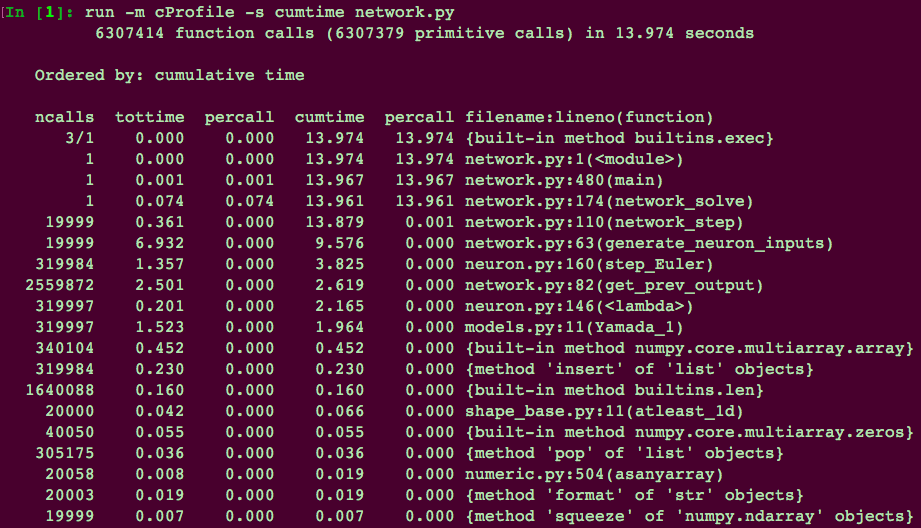

About this project
===================

This project was authored by Joe Abbate, Gerry Angelatos,
and Akshay Krishna for the Princeton University
graduate course APC524 (fall 2018). 

All of the code, along with a link to the readthedocs site,
is available at 
`https://github.com/jabbate7/PhotonicNeuronSimulator
<https://github.com/jabbate7/PhotonicNeuronSimulator>`_.

Documentation is generated via `Sphinx
<http://www.sphinx-doc.org/en/master/>`_.

In addition to the pip packages specified in requirements.txt, you must install 
`ffmpeg`_ to create animations. 

.. _ffmpeg: https://www.ffmpeg.org/

Testing
--------

Unit tests are automatically run by `Travis
<https://travis-ci.org/>`_ each time new code is pushed, 
and the readme automatically displays whether the tests 
are passing or failing. The unit tests are written in ``test.py``
and include basic and complex cases for both neurons and networks. 

Profiling
----------

We used the `cProfile <https://docs.python.org/2/library/profile.html>`_ utility to profile our neural network 
solver. Our benchmarking was done for a 4-input 16-neuron network 
with random weights and delays. Our input was a time series of length 20000.

   Profiling results

The entire simulation takes about 14 seconds to run. Each of the 
``network_step()`` and ``generate_neuron_inputs()`` functions is called 
19999 times (the number of time steps necesary to move through the time series). 
The most time consuming step was in the ``generate_neuron_inputs()`` function. 

This function calculates the sum of all weighted and delayed inputs to each neuron 
in the network. By necessity, it must loop over all nonzero neurons on the network, 
and iterate over all entries in the adjacency matrix of connections. Further algorithmic 
optimization is not possible, to the authors' knowledge. 