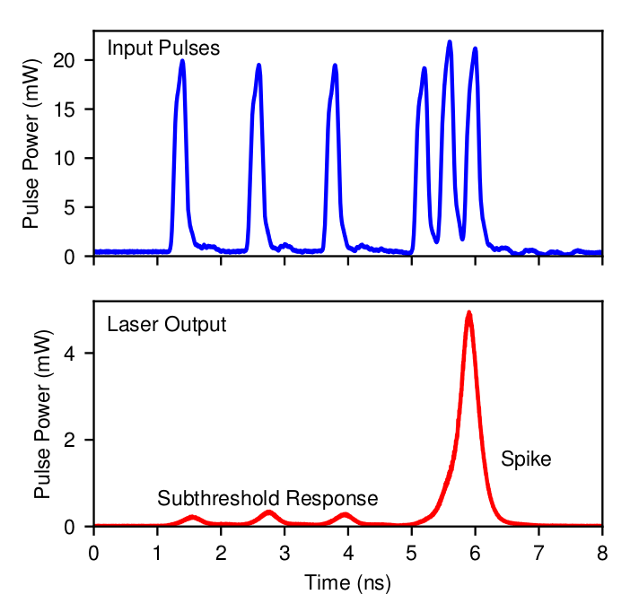

Background
=============

Problem Description
-----------------------

Neuromorphic or cognitive computing is a rapidly growing frontier of research which seeks to develop new computational processors inspired by the architecture of the brain.  In such systems, the fundamental processing unit is a "neuron", which responds to inputs above threshold with a large amplitude pulse (a spike) before refracting to its rest state.  As with their biological counterpart, collections of these neurons are connected to form a network:  the state of a given neuron is relayed to its neighbours via a "synapse" which applies a configurable weight and delay to its output signal. These weighted and delayed outputs are summed at a given neuron to forms its input, which governs its spiking behaviour.  

In this project we will design a modular spiking neural network simulator.  For an arbitrary fundamental neuron model and network topology (number of neurons, synaptic weights and delays) we plan on computing its dynamics and visualizing each neuron's state. 

A variety of different technologies have been explored to develop spiking neural networks; we are particularly interested in the photonic networks of laser neurons being developed by the Prucnal lab at Princeton (see the references from Nahmias and Shastri below), with which Gerry Angelatos is a collaborator.  However the simulator will be designed to handle any user specified fundamental neuron described by a set of ordinary differential equations (ODEs).

Brief Mathematical Theory
---------------------------

Generically, excitable dynamics arise when one has a stable fixed point surrounded by a finite basin of attraction, and perturbations forcing the state outside this basin of attraction result in large phase space excursions before the system returns to equilibrium (i.e. a spike). For this to be possible, a single neuron's set of ODEs must be at least two dimensional. Excitability also requires a "slow-fast" system, where one variable evolves on a much slower timescale than the other, so the faster variable is able to grow rapidly once the system exceeds threshold, and the slower variable's recovery leads to a refractory period between pulses.  This complicates numerical simulation as it mandates the existence of disparate time scales on the individual neuron and network levels.

.. figure:: graphics/dyn_inib_A604_B5_g10.eps
   :align: center

   Simulated Yamada model dynamics showing that negative input currents can be used to inhibit a response   

   Measured integrated laser neuron output, showing that only a train of pulses are sufficient to push the system above threshold and produce a spike

A prototypical model for biological neurons is the FitzHugh Nagamo model

:math:`\begin{equation} \dot{V}=f(V)-W+i_{in}(t) \\ \dot{W}=a(bV-cW) \end{equation}`

where :math:`V` is the fast membrane voltage and :math:`W` dimensionless ion conductance, a slower recovery variable (:math:`a \ll 1`).  :math:`i_{in}` is the input current and :math:`f(v)` is a cubic or higher polynomial ensuring a stable fixed point for :math:`I_{in}` below threshold.  The laser neurons studied by the Prucnal are two-section lasers which can be described by a Yamada model

:math:`\begin{equation} \dot{I}=(1-G-Q)I+\beta \\ \dot{G}=\gamma(A+i_{in}(t)-G-IG) \\ \dot{Q}=\gamma(B-Q-aIQ) \end{equation}`

where :math:`I` is the laser intensity and :math:`G` and :math:`Q` are inversions of each section of gain material.  :math:`i_{in}` sufficient to produce :math:`G+Q>1` produce a sharp laser pulse and the system then refracts (:math:`\gamma \ll 1`).  Both numerically calculated and measured dynamics for this system are shown in the figures above.

Further Readings
-------------------
1. Nahmias et al, IEEE, 2013, DOI: `10.1109/JSTQE.2013.2257700 <https://www.researchgate.net/publication/260636128_A_Leaky_Integrate-and-Fire_Laser_Neuron_for_Ultrafast_Cognitive_Computing>`_
2. Shastri et al, arXiv, 2014, arXiv: `1407.2917 <http://arxiv.org/abs/1407.2917/>`_ 
