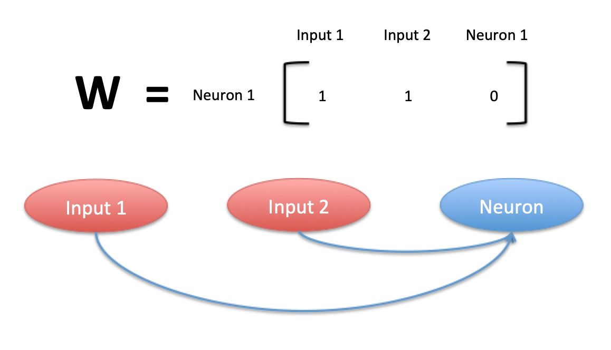

Implementation 
----------------

Overview
=========

With our Photonic Neural Network Simulator, our aim is to provide an easy-to-use and versatile interface to simulate the time dynamics of excitable neurons and networks of these neurons.

The primary building blocks of our implementation are:

- a ``neuron`` class: this class defines an object that takes a time-varying input :math:`x(t)` , and emits a time-varying output :math:`y(t)`.This class contains attributes that allow one to specify the type of model to be solved, the ODE solver to be used (currently support Euler and RK4), the size of the time-step :math:`dt` and so on. The neuron class also contains functions that allow us to find the zero-input steady-state of the neuron, as well as stepping the neuron's history forward in time.
- a ``network`` class: this class defines a network formed by connecting neurons. A network is specified by a list of neuron objects. The connections between external inputs to the network and the neurons in the network as well as the connections among the neurons themselves are specified by two adjacency matrices. One matrix specifies the weights of the edges in the graph. The weights control to what extent signals are amplified or attenuated as they propagate. Another matrix specifies time delays from one node to another. The following section describes how to define these connections.
- a ``models.py``: this file contains various neuron models, corresponding to different physical implementations of excitable neurons. Currently support three kinds of Yamada models, the Fitz-Hugh-Nagumo model, and an identity (input = output) model.
- a ``test.py``: this file contains test units to verify the above code is working.  Testing is done automatically with Tavis, but can also be run manually.

Defining network connections
==============================

A network can be thought of as a system of inputs and outputs. 

To construct your W matrix, consider the examples in the following images. 

.. figure:: graphics/simple_network.png
   :align: center

   Simple network

.. figure:: graphics/complex_network.png
   :align: center

   Complicated network

   Multi-input network

Each row corresponds to a neuron. Each column corresponds to an input source, with the raw inputs coming first and the neurons coming second. The element of W in row i and column j should be interpreted as "neuron i gets its input from input-source j". 

The time delay matrix is simpler. In a similar way, the element of T in row i and column j should be interpreted as "neuron i gets its input from neuron j".

.. figure:: graphics/time_delay_example.png
   :align: center

   Time delay matrix format
