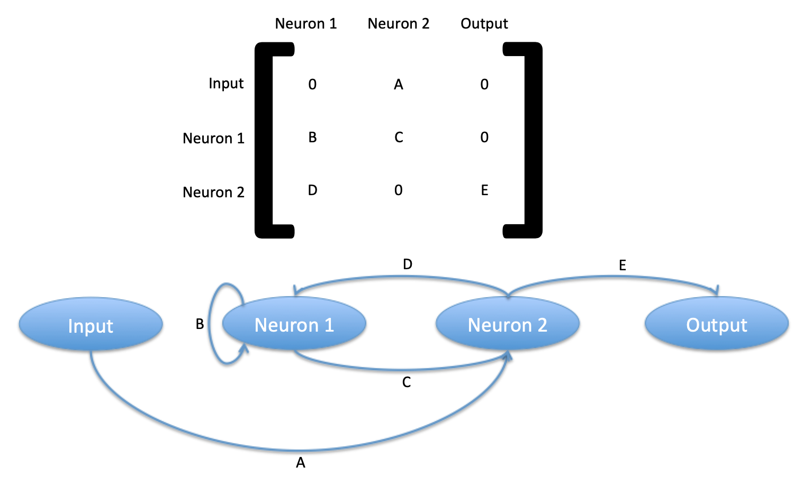
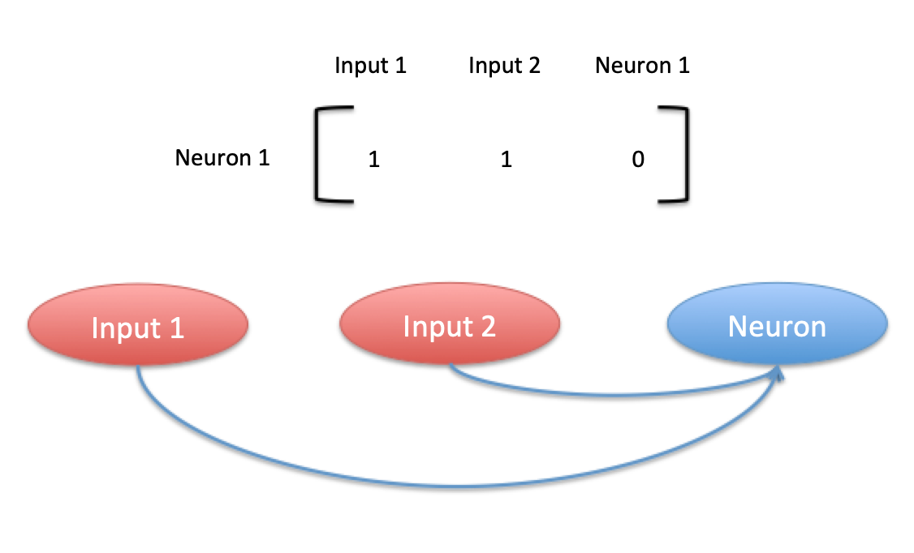

## Network:
A Network is a specific topology of connected Neuron objects. Connections between neurons can be weighted, and also can carry a time delay. There can be multiple input sources, which can be connected to any neurons. These connections also have associated weights and time delays. 

Once initialized, a Network's primary method is to take in a set of signals at a given timestep and reveal the updated neuron states. 

### Defining connections

A network can be thought of as a system with $N+I$ "nodes" and $(N+I)^2$ "connections" between them, where $N$ is the number of neurons and $I$ is the number of inputs. 

To build your W and T matrices, consider the example in the image above. Read this as "neuron 1 (leftmost array) takes from input, neuron 2 (inner array) takes from neuron 1, output takes from neuron 2".

